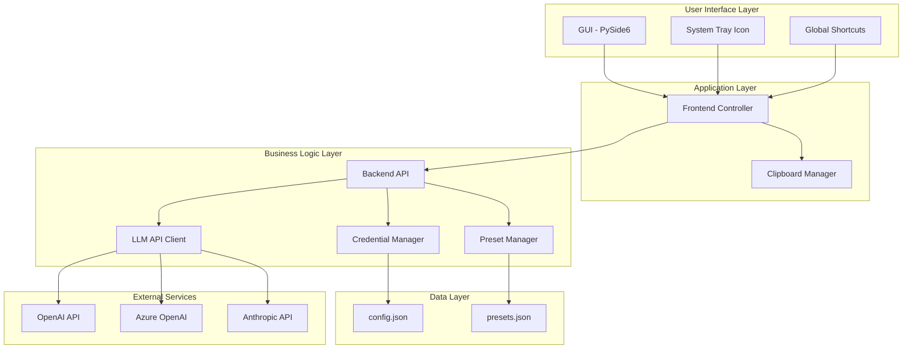
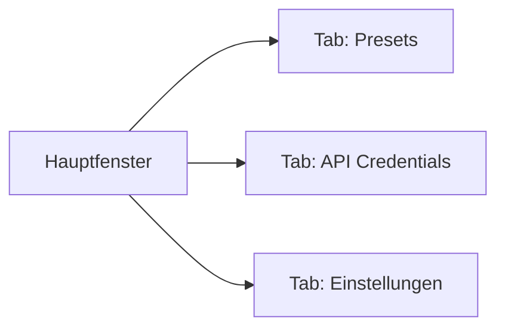
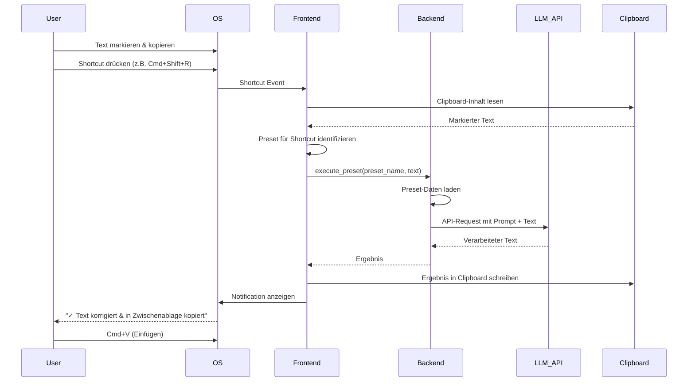

# PromptPilot - Projektkonzept

## 1. Einleitung

Dieses Dokument enthält die vollständige Planung des Projekts **PromptPilot**. Es beschreibt die grundlegenden Ideen und Strukturen, die für die Entwicklung des Tools wichtig sind.

### 1.1 Projektziel

Das Ziel ist es, ein Python-basiertes Tool zu entwickeln, um einen persönlichen Use Case zu lösen: die Automatisierung repetitiver Aufgaben bei der Nutzung von Large Language Models (LLMs).

### 1.2 Problemstellung

Wir nutzen LLMs (wie ChatGPT, Claude, etc.) häufig im privaten Bereich. Dabei gibt es bestimmte Aufgaben, die sehr repetitiv sind - wir verwenden immer wieder die gleichen Prompts und müssen die Ergebnisse manuell in die gewünschte Applikation einfügen.

#### Beispiel-Workflow (aktuell):

1. Ich schreibe ein Motivationsschreiben für eine Bewerbung
2. Ich möchte den Text auf Rechtschreibung prüfen und korrigieren lassen
3. Aktueller Prozess:
   - Browser öffnen und zur OpenAI-, Claude- oder Ollama-Seite navigieren
   - Prompt eingeben, um den Text korrigieren zu lassen
   - Korrigierten Text kopieren
   - Text in mein Dokument einfügen

### 1.3 Lösungsansatz

Dieser Prozess soll wie folgt automatisiert werden:

1. **Einmalige Konfiguration**: Ein Preset im Tool festlegen über eine grafische Oberfläche
   - Definition des zu verwendenden LLM (via API)
   - Definition des Prompts
   - Definition der Tastenkombination

2. **Zukünftige Nutzung**:
   - Text im Dokument markieren
   - Tastenkombination drücken
   - Tool öffnet sich automatisch im Hintergrund und startet den Prozess:
     - Sendet markierten Text an das LLM via API
     - Gibt korrigierten Text in die Zwischenablage zurück

---

## 2. Technische Umsetzung

### 2.1 Programmiersprache

Das gesamte Tool wird in **Python** entwickelt.

### 2.2 Architektur

Die Anwendung wird in **Frontend** und **Backend** unterteilt, um:
- Die Entwicklung übersichtlicher zu gestalten
- Paralleles Arbeiten zu ermöglichen
- Klare Trennung der Verantwortlichkeiten zu gewährleisten

### 2.3 Architektur-Übersicht



---

## 3. Frontend

### 3.1 Technologie

- **Sprache**: Python
- **Framework**: PySide6 (Qt for Python)

### 3.2 Verantwortlichkeiten

Das Frontend ist zuständig für:
- Grafische Benutzeroberfläche (GUI)
- Erstellen neuer Presets via UI
- Verwalten bestehender Presets
- Hinzufügen und Verwalten von API-Credentials
- Shortcut-Verwaltung und -Ausführung
- Einfügen von Ergebnissen in die Zwischenablage

### 3.3 GUI-Design-Anforderungen

Das GUI soll:
- ✓ Modern und benutzerfreundlich sein
- ✓ Simpel und funktional gestaltet sein
- ✓ Nicht mit unnötigem Schnickschnack überladen sein
- ✓ Klare Navigation und intuitive Bedienung bieten

### 3.4 GUI-Struktur

Das Hauptfenster ist in drei Hauptbereiche unterteilt:



#### 3.4.1 Tab 1: Presets

**Layout-Beschreibung:**
```
┌─────────────────────────────────────────────────────────────┐
│  PromptPilot                                    [_][□][X]   │
├─────────────────────────────────────────────────────────────┤
│  [Presets] [API Credentials] [Einstellungen]                │
├─────────────────────────────────────────────────────────────┤
│                                                             │
│  Meine Presets                          [+ Neues Preset]    │
│  ┌────────────────────────────────────────────────────────┐ │
│  │                                                        │ │
│  │  vv Rechtschreibung korrigieren        Cmd+Shift+R     │ │
│  │     OpenAI GPT-4                                       │ │
│  │     [Bearbeiten] [Löschen] [Test]                      │ │
│  │  ─────────────────────────────────────────────────     │ │
│  │                                                        │ │
│  │  vv  Text umformulieren                Cmd+Shift+U     │ │
│  │     Anthropic Claude 3                                 │ │
│  │     [Bearbeiten] [Löschen] [Test]                      │ │
│  │  ─────────────────────────────────────────────────     │ │
│  │                                                        │ │
│  │     Text übersetzen (DE→EN)            Cmd+Shift+T     │ │
│  │     Azure OpenAI GPT-4                                 │ │
│  │     [Bearbeiten] [Löschen] [Test]                      │ │
│  │                                                        │ │
│  └────────────────────────────────────────────────────────┘ │
│                                                             │
└─────────────────────────────────────────────────────────────┘
```

**Funktionen:**
- Liste aller erstellten Presets
- Anzeige von: Name, Icon, Shortcut, verwendetes LLM
- Buttons: Bearbeiten, Löschen, Test (testet Preset mit Dummy-Text)
- Button "Neues Preset" öffnet Dialog zum Erstellen

**Preset-Erstellungs-Dialog:**
```
┌─────────────────────────────────────────────────┐
│  Neues Preset erstellen              [X]        │
├─────────────────────────────────────────────────┤
│                                                 │
│  Name: [________________________]               │
│                                                 │
│    Icon:    [Auswählen...]                      │
│                                                 │
│  LLM-Anbieter:                                  │
│  ┌───────────────────────────────────────┐      │
│  │ ○ OpenAI                              │      │
│  │ ○ Azure OpenAI                        │      │
│  │ ○ Anthropic (Claude)                  │      │
│  └───────────────────────────────────────┘      │
│                                                 │
│  Modell: [GPT-4 ▼]                              │
│                                                 │
│  System-Prompt:                                 │
│  ┌───────────────────────────────────────┐      │
│  │ Korrigiere den folgenden Text auf     │      │
│  │ Rechtschreibung und Grammatik...      │      │
│  │                                       │      │
│  └───────────────────────────────────────┘      │
│                                                 │
│  Shortcut: [Cmd] + [Shift] + [R]                │
│            [Aufnehmen] [Löschen]                │
│                                                 │
│  API-Temperatur: [0.7] ────────○─────           │
│                   (0.0 - 1.0)                   │
│                                                 │
│  Max Tokens: [2000] ──────○──────────           │
│               (100 - 4000)                      │
│                                                 │
│         [Abbrechen]  [Speichern]                │
└─────────────────────────────────────────────────┘
```

#### 3.4.2 Tab 2: API Credentials

**Layout-Beschreibung:**
```
┌─────────────────────────────────────────────────────────────┐
│  PromptPilot                                    [_][□][X]   │
├─────────────────────────────────────────────────────────────┤
│  [Presets] [API Credentials] [Einstellungen]                │
├─────────────────────────────────────────────────────────────┤
│                                                             │
│  API Zugangsdaten                                           │
│                                                             │
│  ┌────────────────────────────────────────────────────────┐ │
│  │                                                        │ │
│  │  OpenAI                                   [Konfiguriert] │
│  │  ┌──────────────────────────────────────────────────┐  │ │
│  │  │ API Key: sk-...xY7Z (Gesetzt)                    │  │ │
│  │  │ Organization ID: (Optional)                      │  │ │
│  │  └──────────────────────────────────────────────────┘  │ │
│  │  [Bearbeiten] [Löschen] [Verbindung testen]            │ │
│  │                                                        │ │
│  │  ───────────────────────────────────────────────────   │ │
│  │                                                        │ │
│  │  Azure OpenAI                 [Nicht konfiguriert]     │ │
│  │  [Hinzufügen]                                          │ │
│  │                                                        │ │
│  │  ───────────────────────────────────────────────────   │ │
│  │                                                        │ │
│  │  Anthropic (Claude)                 [Konfiguriert]     │ │
│  │  ┌──────────────────────────────────────────────────┐  │ │
│  │  │ API Key: sk-ant-...Ab3C (Gesetzt)                │  │ │
│  │  └──────────────────────────────────────────────────┘  │ │
│  │  [Bearbeiten] [Löschen] [Verbindung testen]            │ │
│  │                                                        │ │
│  └────────────────────────────────────────────────────────┘ │
│                                                             │
│     Hinweis: API-Schlüssel werden lokal in einer            │
│     config.json gespeichert und nicht verschlüsselt.        │
│                                                             │
└─────────────────────────────────────────────────────────────┘
```

**Credential-Eingabe-Dialog (OpenAI Beispiel):**
```
┌─────────────────────────────────────────────────┐
│  OpenAI API konfigurieren            [X]        │
├─────────────────────────────────────────────────┤
│                                                 │
│  API Key: *                                     │
│  [_______________________________________]      │
│                                                 │
│  Organization ID: (Optional)                    │
│  [_______________________________________]      │
│                                                 │
│  Base URL: (Optional - für Custom Endpoints)    │
│  [https://api.openai.com/v1___________]         │
│                                                 │
│     Wo finde ich meinen API Key?                │
│     → https://platform.openai.com/api-keys      │
│                                                 │
│         [Abbrechen]  [Speichern & Testen]       │
└─────────────────────────────────────────────────┘
```

#### 3.4.3 Tab 3: Einstellungen

**Layout-Beschreibung:**
```
┌─────────────────────────────────────────────────────────────┐
│  PromptPilot                                    [_][□][X]   │
├─────────────────────────────────────────────────────────────┤
│  [Presets] [API Credentials] [Einstellungen]                │
├─────────────────────────────────────────────────────────────┤
│                                                             │
│  Allgemeine Einstellungen                                   │
│                                                             │
│  GUI-Shortcut:                                              │
│  Tastenkombination um PromptPilot zu öffnen:                │
│  [Cmd] + [Shift] + [P]                                      │
│  [Aufnehmen] [Zurücksetzen]                                 │
│                                                             │
│  ───────────────────────────────────────────────────────    │
│                                                             │
│  Autostart:                                                 │
│  ☑ PromptPilot beim Systemstart automatisch starten         │
│                                                             │
│  ───────────────────────────────────────────────────────    │
│                                                             │
│  System Tray:                                               │
│  ☑ Icon in der Menüleiste anzeigen                          │
│  ☑ Bei Fenster-Schließen in Hintergrund minimieren          │
│                                                             │
│  ───────────────────────────────────────────────────────    │
│                                                             │
│  Benachrichtigungen:                                        │
│  ☑ Erfolgreiche Ausführung anzeigen                         │
│  ☑ Fehler-Benachrichtigungen anzeigen                       │
│                                                             │
│  ───────────────────────────────────────────────────────    │
│                                                             │
│  Datenspeicherort:                                          │
│  ~/Library/Application Support/PromptPilot/                 │
│  [Ordner öffnen]                                            │
│                                                             │
│  ───────────────────────────────────────────────────────    │
│                                                             │
│  Über PromptPilot                                           │
│  Version: 1.0.0                                             │
│  Entwickelt von: Cian Vonlanthen & Malik Zehnder            │
│                                                             │
└─────────────────────────────────────────────────────────────┘
```

### 3.5 System Tray Integration

**Menu-Struktur:**
```
┌─────────────────────────────┐
│ 🚀 PromptPilot              │
├─────────────────────────────┤
│ 📝 Rechtschreibung (⇧⌘R)    │
│ ✍️  Umformulieren (⇧⌘U)     │
│ 🌐 Übersetzen (⇧⌘T)         │
├─────────────────────────────┤
│ ⚙️  PromptPilot öffnen...   │
│ 🔄 Presets neu laden        │
├─────────────────────────────┤
│ ❌ Beenden                  │
└─────────────────────────────┘
```

**Funktionen:**
- Schnellzugriff auf alle Presets
- Direktes Ausführen von Presets (verwendet aktuellen Clipboard-Inhalt)
- PromptPilot GUI öffnen
- Presets neu laden (falls manuell editiert)
- Beenden der Anwendung

### 3.6 Hintergrund-Modus

- Das Frontend muss im normalen Gebrauch nicht geöffnet sein
- Es wird nur für die Verwaltung von Presets und Credentials benötigt
- **Minimierung**: Das Fenster kann geschlossen werden, während die Anwendung im Hintergrund weiterläuft
- **Reaktivierung**: Im Einstellungs-Tab kann ein Shortcut definiert werden (oder der vordefinierte verwendet werden), um das GUI wieder zu öffnen

### 3.7 Shortcut-Interaktion

Die Interaktion via Shortcut erfolgt über das Frontend:



**Ablauf im Detail:**
1. User markiert Text in beliebiger Anwendung
2. User drückt definierte Tastenkombination (z.B. Cmd+Shift+R)
3. Frontend erfasst Shortcut-Event
4. Frontend liest aktuellen Clipboard-Inhalt (markierter Text)
5. Frontend identifiziert zugehöriges Preset anhand des Shortcuts
6. Frontend sendet Request an Backend mit Preset-Name und Text
7. Backend verarbeitet Anfrage über LLM-API
8. Backend gibt Ergebnis zurück an Frontend
9. Frontend schreibt Ergebnis in Clipboard
10. Frontend zeigt Erfolgs-Notification
11. User kann mit Cmd+V das Ergebnis einfügen

---

## 4. Backend

### 4.1 Verantwortlichkeiten

Das Backend hat folgende Funktionen:

- **Preset-Verwaltung**: Erstellen, Updaten, Löschen, Auflisten
- **Credential-Verwaltung**: Speichern, Löschen, Auflisten
- **LLM-API-Kommunikation**: Integration mit:
  - OpenAI
  - Azure OpenAI
  - Anthropic (Claude)

### 4.2 Nutzungsszenarien

Das Backend kommt zum Einsatz, wenn der User via Frontend:
- Ein neues Preset erstellt oder löscht
- Ein bestehendes Preset ausführen möchte
- Neue API-Credentials speichern oder löschen möchte

### 4.3 Datenfluss bei Preset-Ausführung

1. **Frontend → Backend**: Übergabe der notwendigen Daten
   - Preset-Name
   - Eingabedaten (markierter Text vom User)

2. **Backend-Verarbeitung**:
   - Laden der restlichen Preset-Daten aus der JSON-Datei
   - API-Anfrage an das definierte LLM durchführen

3. **Backend → Frontend**: Rückgabe des Ergebnisses
   - Frontend fügt Ergebnis in die Zwischenablage ein

### 4.4 Datenstrukturen

#### Preset-Struktur (presets.json):
```json
{
  "presets": [
    {
      "id": "uuid-1234-5678-90ab",
      "name": "Rechtschreibung korrigieren",
      "icon": "📝",
      "shortcut": "Cmd+Shift+R",
      "provider": "openai",
      "model": "gpt-4",
      "system_prompt": "Korrigiere den folgenden Text auf Rechtschreibung und Grammatik. Gib nur den korrigierten Text zurück ohne weitere Erklärungen.",
      "temperature": 0.7,
      "max_tokens": 2000,
      "created_at": "2025-10-23T10:30:00Z",
      "updated_at": "2025-10-23T10:30:00Z"
    }
  ]
}
```

#### Config-Struktur (config.json):
```json
{
  "credentials": {
    "openai": {
      "api_key": "sk-proj-...",
      "organization_id": "",
      "base_url": "https://api.openai.com/v1"
    },
    "azure_openai": {
      "api_key": "",
      "endpoint": "",
      "api_version": "2024-02-15-preview"
    },
    "anthropic": {
      "api_key": "sk-ant-..."
    }
  },
  "settings": {
    "gui_shortcut": "Cmd+Shift+P",
    "autostart": true,
    "show_tray_icon": true,
    "minimize_to_tray": true,
    "show_success_notifications": true,
    "show_error_notifications": true,
    "data_directory": "~/Library/Application Support/PromptPilot/"
  }
}
```

---

## 5. API-Schnittstellen

### 5.1 Backend-Endpoints

Das Backend stellt folgende Endpoints bereit (JSON-basiert):

| Endpoint | Beschreibung | Input | Output |
|----------|--------------|-------|--------|
| `create_preset` | Erstellen eines neuen Presets | Preset-Objekt | Preset mit ID |
| `update_preset` | Updaten eines bestehenden Presets | Preset-ID + Update-Daten | Aktualisiertes Preset |
| `delete_preset` | Löschen eines Presets | Preset-ID | Success/Error |
| `list_presets` | Auflisten aller Presets | - | Array von Presets |
| `execute_preset` | Ausführen eines Presets | Preset-Name + Input-Text | Verarbeiteter Text |
| `test_llm_api` | Testen der LLM-API-Verbindung | Provider-Name | Success/Error |
| `save_credentials` | Speichern von API-Credentials | Provider + Credentials | Success/Error |
| `delete_credentials` | Entfernen von API-Credentials | Provider-Name | Success/Error |
| `list_credentials` | Auflisten aller gespeicherten Credentials | - | Provider-Liste (ohne Keys) |

### 5.2 Datenformat

Alle Kommunikation zwischen Frontend und Backend erfolgt im **JSON-Format**.

**Beispiel - Execute Preset Request:**
```json
{
  "action": "execute_preset",
  "data": {
    "preset_name": "Rechtschreibung korrigieren",
    "input_text": "Dies ist ein text mit rechtschreibfehlern."
  }
}
```

**Beispiel - Execute Preset Response:**
```json
{
  "status": "success",
  "data": {
    "output_text": "Dies ist ein Text mit Rechtschreibfehlern.",
    "tokens_used": 42,
    "processing_time_ms": 1250
  }
}
```

---

## 6. Sicherheitskonzept für API-Credentials

### 6.1 Speicherort und Sicherheitsphilosophie

Da **PromptPilot** eine lokale Desktop-Anwendung ist, die ausschließlich auf dem Rechner des jeweiligen Users läuft, wird folgende Sicherheitsstrategie angewendet:

**Grundprinzipien:**
- ✓ Lokale Speicherung auf dem User-System
- ✓ Keine Cloud-Synchronisation der Credentials
- ✓ Keine Verschlüsselung der Credentials (da lokale Anwendung)
- ✓ Dateisystem-Berechtigungen als Schutz

### 6.2 Speicherort der Credentials

**macOS:**
```
~/Library/Application Support/PromptPilot/
├── config.json          (enthält API-Credentials und Einstellungen)
├── presets.json         (enthält alle Presets)
└── logs/                (zukünftig für Logs)
```

**Windows:**
```
%APPDATA%\PromptPilot\
├── config.json
├── presets.json
└── logs\
```

### 6.3 Dateiberechtigungen

Die Anwendung setzt beim ersten Start automatisch restriktive Dateiberechtigungen:

**macOS:**
- `config.json`: `chmod 600` (nur Owner kann lesen/schreiben)
- `presets.json`: `chmod 644` (Owner read/write, Others read)

**Windows:**
- Entsprechende NTFS-Berechtigungen nur für den aktuellen User

### 6.4 Credential-Format in config.json

```json
{
  "credentials": {
    "openai": {
      "api_key": "sk-proj-abc123...",
      "organization_id": "org-xyz789",
      "base_url": "https://api.openai.com/v1"
    },
    "azure_openai": {
      "api_key": "your-azure-key",
      "endpoint": "https://your-resource.openai.azure.com/",
      "api_version": "2024-02-15-preview",
      "deployment_name": "gpt-4"
    },
    "anthropic": {
      "api_key": "sk-ant-abc123..."
    }
  }
}
```

### 6.5 Sicherheitshinweise für User

In der GUI wird folgender Hinweis angezeigt:

```
ℹ️  Sicherheitshinweis zu API-Credentials:

Ihre API-Schlüssel werden lokal auf Ihrem Computer in einer 
JSON-Datei gespeichert und nicht verschlüsselt.

PromptPilot sendet Ihre Credentials niemals an Dritte - sie 
werden ausschließlich für direkte API-Anfragen an die von 
Ihnen gewählten LLM-Anbieter verwendet.

Stellen Sie sicher, dass:
• Ihr Computer durch ein Passwort geschützt ist
• Backups Ihrer Festplatte sicher aufbewahrt werden
• Sie config.json nicht in Cloud-Ordnern speichern

Speicherort: ~/Library/Application Support/PromptPilot/config.json
```

### 6.6 Begründung für nicht verschlüsselte Speicherung

**Warum keine Verschlüsselung?**

1. **Lokale Anwendung**: Die App läuft lokal, Verschlüsselung würde einen Master-Key erfordern
2. **Key-Management-Problem**: Der Master-Key müsste entweder:
   - Im Code gespeichert werden → keine zusätzliche Sicherheit
   - Vom User eingegeben werden → schlechte UX, User muss sich Passwort merken
3. **OS-Sicherheit**: macOS/Windows bieten bereits Dateisystem-Verschlüsselung (FileVault/BitLocker)
4. **Vergleichbare Tools**: Ähnliche Desktop-Tools (z.B. Git Credentials, AWS CLI) speichern ebenfalls unverschlüsselt

**Alternative Ansätze für zukünftige Versionen:**
- macOS Keychain-Integration (System-Passwort-Manager)
- Windows Credential Manager
- Optional: User-definiertes Master-Passwort mit Keyring-Library

---

## 7. Deployment & Distribution

### 7.1 Ziel

Am Ende des Projekts soll das Tool:
- In ein einzelnes Script gepackt werden
- Zu einer vollständig funktionalen **macOS-Anwendung** (.app) kompiliert werden
- Für den Enduser so einfach wie möglich nutzbar sein
- Ohne großen Aufwand für Installation von Abhängigkeiten funktionieren

### 7.2 Plattformen

- **Hauptfokus**: macOS (da beide Entwickler Mac-User sind)
- **Sekundär**: Windows (zukünftig mit PyInstaller)

### 7.3 Packaging mit py2app (macOS)

#### 7.3.1 Warum py2app?

**Vorteile:**
- ✓ Speziell für macOS entwickelt
- ✓ Erstellt native .app-Bundles
- ✓ Gute Integration mit macOS-Features (Tray, Shortcuts, etc.)
- ✓ Unterstützt Code-Signing und Notarisierung für Distribution
- ✓ Exzellente Kompatibilität mit PySide6/Qt

#### 7.3.2 Setup-Konfiguration

**setup.py für py2app:**

```python
from setuptools import setup

APP = ['frontend.py']
DATA_FILES = [
    ('', ['presets.json', 'config.json']),
]
OPTIONS = {
    'argv_emulation': False,
    'packages': ['PySide6', 'requests', 'anthropic', 'openai'],
    'includes': ['backend'],
    'excludes': ['tkinter', 'matplotlib', 'numpy'],
    'iconfile': 'assets/icon.icns',
    'plist': {
        'CFBundleName': 'PromptPilot',
        'CFBundleDisplayName': 'PromptPilot',
        'CFBundleIdentifier': 'com.vonlanthen-zehnder.promptpilot',
        'CFBundleVersion': '1.0.0',
        'CFBundleShortVersionString': '1.0.0',
        'NSHumanReadableCopyright': '© 2025 Cian Vonlanthen & Malik Zehnder',
        'LSUIElement': True,  # App läuft im Hintergrund ohne Dock-Icon
        'LSMinimumSystemVersion': '10.15.0',
        'NSAppleEventsUsageDescription': 'PromptPilot benötigt Zugriff auf globale Shortcuts.',
        'NSSystemAdministrationUsageDescription': 'Für Autostart-Funktionalität.',
    }
}

setup(
    name='PromptPilot',
    app=APP,
    data_files=DATA_FILES,
    options={'py2app': OPTIONS},
    setup_requires=['py2app'],
)
```

#### 7.3.3 Build-Prozess

**Entwicklungsmodus (zum Testen):**
```bash
python setup.py py2app -A
```
- Erstellt Alias-App (schneller)
- Änderungen am Code werden sofort übernommen
- Gut für Entwicklung und Testing

**Produktionsmodus (für Distribution):**
```bash
python setup.py py2app
```
- Erstellt standalone .app Bundle
- Alle Abhängigkeiten werden eingebettet
- Bereit für Distribution

**Build-Ausgabe:**
```
dist/
└── PromptPilot.app/
    └── Contents/
        ├── MacOS/
        │   └── PromptPilot        (ausführbare Datei)
        ├── Resources/
        │   ├── icon.icns
        │   ├── presets.json
        │   ├── config.json
        │   └── lib/
        │       └── python3.x/
        │           └── (alle Dependencies)
        ├── Frameworks/
        │   └── (Qt Frameworks)
        └── Info.plist
```

#### 7.3.4 App-Bundle-Struktur

```
PromptPilot.app/
├── Contents/
│   ├── Info.plist              (App-Metadaten)
│   ├── MacOS/
│   │   └── PromptPilot         (Hauptausführbare Datei)
│   ├── Resources/
│   │   ├── icon.icns           (App-Icon)
│   │   ├── presets.json        (Standard-Presets)
│   │   ├── config.json         (Default-Config)
│   │   └── lib/
│   │       └── python3.13/
│   │           ├── backend.py
│   │           ├── frontend.py
│   │           └── site-packages/
│   │               ├── PySide6/
│   │               ├── openai/
│   │               ├── anthropic/
│   │               └── ...
│   └── Frameworks/
│       ├── QtCore.framework
│       ├── QtGui.framework
│       ├── QtWidgets.framework
│       └── ...
```

#### 7.3.5 Code-Signing & Notarisierung (Optional für Distribution)

**Für öffentliche Distribution:**

1. **Developer Certificate beantragen** (Apple Developer Account erforderlich)
2. **Code-Signing:**
   ```bash
   codesign --deep --force --verify --verbose \
            --sign "Developer ID Application: YOUR_NAME" \
            dist/PromptPilot.app
   ```

3. **DMG erstellen:**
   ```bash
   hdiutil create -volname "PromptPilot" -srcfolder dist/PromptPilot.app \
           -ov -format UDZO dist/PromptPilot.dmg
   ```

4. **Notarisierung bei Apple:**
   ```bash
   xcrun notarytool submit dist/PromptPilot.dmg \
         --apple-id "your@email.com" \
         --team-id "TEAM_ID" \
         --password "app-specific-password"
   ```

**Für private Nutzung:**
- Code-Signing nicht zwingend erforderlich
- User müssen App über Systemeinstellungen freigeben (Gatekeeper)
- Oder: User hält beim ersten Start Command-Taste und öffnet per Rechtsklick

#### 7.3.6 Abhängigkeiten

**Python-Pakete (requirements.txt):**
```
PySide6>=6.6.0
openai>=1.0.0
anthropic>=0.8.0
requests>=2.31.0
py2app>=0.28
pynput>=1.7.6          # für globale Shortcuts
pyperclip>=1.8.2       # für Clipboard-Operationen
```

**System-Requirements:**
- macOS 10.15 (Catalina) oder neuer
- 200 MB freier Speicherplatz
- Internetverbindung (für API-Calls)

#### 7.3.7 Distribution

**Methode 1: DMG-Image (empfohlen)**
- User lädt DMG-Datei herunter
- Öffnet DMG
- Zieht PromptPilot.app in den Programme-Ordner
- Fertig!

**Methode 2: ZIP-Archiv**
- User lädt ZIP herunter
- Entpackt Archiv
- Verschiebt .app in Programme-Ordner

**Methode 3: GitHub Releases**
- DMG bei GitHub Releases hochladen
- User kann direkt von GitHub downloaden
- Versions-Tracking automatisch

#### 7.3.8 Erste Ausführung

**User-Erfahrung beim ersten Start:**

1. User startet PromptPilot.app
2. macOS Gatekeeper-Warnung (falls nicht signiert):
   - "PromptPilot kann nicht geöffnet werden, da es von einem nicht verifizierten Entwickler stammt"
   - Lösung: Systemeinstellungen → Sicherheit → "Dennoch öffnen"
3. PromptPilot startet und erstellt Konfigurationsordner:
   - `~/Library/Application Support/PromptPilot/`
4. GUI öffnet sich mit Willkommens-Screen
5. User wird aufgefordert, erste API-Credentials einzugeben

#### 7.3.9 Update-Mechanismus (zukünftig)

**Mögliche Ansätze:**
- Sparkle Framework (Standard für macOS Apps)
- Eigener Update-Checker (GitHub Releases API)
- Manueller Download neuer Versionen

---

## 8. Offene Punkte für Proof of Concept

Die folgenden Aspekte werden im Proof of Concept (PoC) implementiert und getestet:

- [ ] Error-Handling-Strategie
- [ ] Logging-Konzept
- [ ] Testing-Strategie
- [ ] Performance-Optimierung
- [ ] Edge-Case-Behandlung

---

## 9. Zusammenfassung & nächste Schritte

### 9.1 Projektzusammenfassung

**PromptPilot** ist ein Desktop-Tool für macOS (und zukünftig Windows), das die repetitive Nutzung von LLMs automatisiert durch:
- Vordefinierte Presets mit Custom Prompts
- Globale Keyboard-Shortcuts
- Automatische Clipboard-Integration

**Technologie-Stack:**
- Python 3.13
- PySide6 (Qt for Python)
- OpenAI, Anthropic, Azure OpenAI APIs
- py2app für macOS Distribution

### 9.2 Entwicklungsreihenfolge

**Phase 1: Backend-Grundlage**
1. Preset-Verwaltung (JSON CRUD)
2. Credential-Verwaltung (JSON)
3. LLM-API-Integration (OpenAI, Anthropic)

**Phase 2: Frontend-Grundlage**
4. GUI mit PySide6 (Tabs: Presets, Credentials, Settings)
5. Preset-Erstellung und -Verwaltung
6. Credential-Eingabe

**Phase 3: Integration**
7. Frontend-Backend-Kommunikation
8. Global Shortcuts Implementation
9. Clipboard-Integration
10. System Tray Integration

**Phase 4: Deployment**
11. py2app Setup und Testing
12. DMG-Erstellung
13. Dokumentation für User

### 9.3 Erfolgsmetriken

Das Projekt ist erfolgreich, wenn:
- ✓ User ein Preset in < 2 Minuten erstellen kann
- ✓ Preset-Ausführung in < 5 Sekunden erfolgt
- ✓ Installation durch einfaches Drag & Drop möglich ist
- ✓ App stabil im Hintergrund läuft ohne Abstürze
- ✓ Mind. 3 LLM-Provider unterstützt werden

